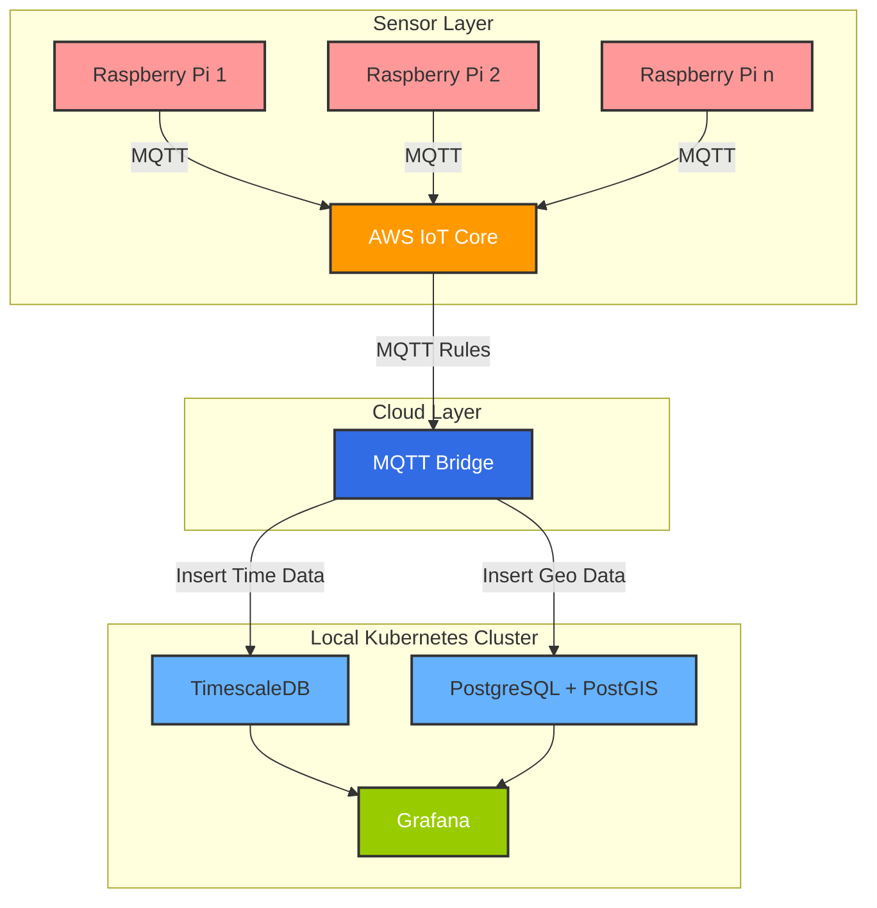

# IoT Sensor Monitoring Project Specifications

## Project Overview

A distributed IoT system that collects environmental sensor data from Raspberry Pis, transmits it through AWS IoT Core, processes it on a local Kubernetes cluster, and visualizes it using Grafana dashboards with time-series and geospatial database integration.

## Architecture Diagram



## Project Goals

- Implement a full IoT data pipeline from sensors to visualization
- Gain hands-on experience with cloud IoT platforms and message brokers
- Practice Kubernetes deployment for backend services
- Work with time-series and geospatial databases
- Create meaningful visualizations of sensor data

## Technology Stack

### Hardware Components

- Raspberry Pi devices (any model with GPIO pins)
- Sensor components:
  - DHT22/AM2302 or BME280 sensors for temperature and humidity
  - MAX9814 or similar microphone module for sound volume measurement
- Local server(s) for Kubernetes cluster
- Network infrastructure for connectivity

### Software Components

1. **Sensor Layer**

   - Python scripts for sensor data collection
   - MQTT client libraries (paho-mqtt)
   - Device certificates for secure communication

2. **Cloud Services**

   - AWS IoT Core for MQTT message brokering
   - AWS IoT Rules for message routing

3. **Kubernetes Cluster**

   - Container runtime (Docker/containerd)
   - Kubernetes distribution of choice
   - Storage classes for database persistence

4. **Databases**

   - TimescaleDB for time-series data storage
   - PostgreSQL with PostGIS extension for geospatial information

5. **Visualization**
   - Grafana for dashboards and alerts

## Implementation Specifications

### Raspberry Pi Configuration

- **Sensors**:
  - DHT22/AM2302 or BME280 for temperature and humidity
  - MAX9814 or similar microphone module for volume/sound level
- **Data Format**: JSON messages including:
  - Sensor readings
  - Timestamp (UTC)
  - Device ID
  - Geolocation (latitude, longitude)
- **Sampling Rate**: Configurable, default to every 5 minutes
- **MQTT Topic Structure**: `sensors/<sensor_type>/<location_id>`

### AWS IoT Core Setup

- **Authentication**: X.509 certificate-based authentication for each device
- **Topics**: Subscribe and publish permissions for sensor topics
- **Rules**: Configure rules to forward messages to local Kubernetes MQTT bridge
- **QoS Level**: QoS 1 (at least once delivery)

### Kubernetes Deployment

- **Namespace**: `iot-monitoring`
- **Deployments**:
  1. MQTT Bridge Container
     - Subscribes to AWS IoT Core
     - Forwards messages to local databases
  2. TimescaleDB
     - Configured with appropriate retention policies
     - Hypertables for efficient time-series queries
  3. PostgreSQL + PostGIS
     - Spatial indexes for location data
  4. Grafana
     - Pre-configured data sources
     - Default dashboards

### Database Schema

1. **TimescaleDB**:

   ```sql
   CREATE TABLE sensor_data (
     time TIMESTAMPTZ NOT NULL,
     device_id TEXT,
     sensor_type TEXT, -- 'temperature', 'humidity', or 'volume'
     value DOUBLE PRECISION,
     location_id TEXT
   );

   SELECT create_hypertable('sensor_data', 'time');
   ```

2. **PostGIS**:

   ```sql
   CREATE TABLE sensor_locations (
     location_id TEXT PRIMARY KEY,
     device_id TEXT,
     description TEXT,
     location GEOGRAPHY(POINT)
   );

   CREATE INDEX location_idx ON sensor_locations USING GIST(location);
   ```

### Grafana Dashboards

1. **Overview Dashboard**

   - Current readings from all sensors
   - System health metrics

2. **Time-Series Dashboard**

   - Historical trends by sensor type
   - Comparison across locations
   - Customizable time ranges

3. **Geospatial Dashboard**
   - Map view of all sensor locations
   - Color-coded by current readings
   - Click-through to detailed sensor information

## Deployment Plans

### Phase 1: Sensor Setup and AWS Configuration

- Configure and test Raspberry Pi sensors
- Set up AWS IoT Core and register devices
- Implement basic data collection scripts

### Phase 2: Kubernetes Infrastructure

- Deploy Kubernetes cluster on local hardware
- Configure persistent storage
- Deploy database containers and ensure persistence

### Phase 3: Data Pipeline Integration

- Deploy MQTT bridge to connect AWS IoT to local databases
- Implement data transformation and storage logic
- Configure database schemas and indexes

### Phase 4: Visualization and Monitoring

- Deploy Grafana
- Create dashboards for various data views
- Configure alerting based on sensor thresholds

## Success Criteria

- Reliable data collection from all sensors
- Secure transmission through AWS IoT Core
- Successful storage in appropriate databases
- Meaningful visualization in Grafana dashboards
- System resilience to network disruptions

## Future Enhancements

- Edge processing on Raspberry Pis using K3s
- Anomaly detection using machine learning
- Weather correlation analysis
- Mobile application for monitoring
- Alerts and notifications for threshold events
